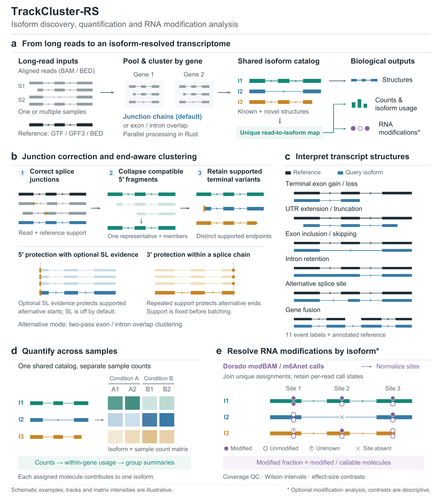

# TrackCluster-RS

**Discover, quantify and interpret transcript isoforms from long reads.**

TrackCluster-RS is a reference-guided, pure-Rust pipeline that turns aligned
long RNA/cDNA reads into a shared isoform catalog, per-sample expression and
isoform usage, and optional RNA modification summaries. It connects transcript
structure, abundance and modification evidence through traceable read-to-isoform
assignments.

[Quickstart](#quickstart) · [Install](#install) · [RNA modifications](#isoform-level-rna-modifications) · [CLI reference](docs/CLI.md) · [Pipeline tutorial](docs/PIPELINE.md)

## Method highlights

- **Correct splice junctions before clustering.** Junction mode combines read
  and reference support to correct nearby low-support splice sites, retain
  supported non-reference sites through correction, and validate reconstructed
  exon structures. Support thresholds and correction distances are configurable.
- **Use terminal evidence to resolve isoforms.** Compatible truncated reads can
  collapse into longer representatives while independently supported terminal
  variants are retained. Optional spliced-leader (SL) evidence protects 5′ starts;
  same-junction 3′ support protects alternative ends. Terminal support is fixed
  before batching so splitting reads across batches does not erase it.
- **Discover together, quantify by sample.** Pool reads once to build a shared
  catalog, then quantify each sample against that catalog. The default unique
  assignment selects one compatible isoform per assigned molecule and records
  the exact mapping used for counts and within-gene usage.
- **Connect RNA modifications to transcript structure.** Normalize external
  Dorado or m6Anet read-level calls and join them to the same final assignments
  used for expression. Keep unknown calls and structurally absent sites distinct
  from unmodified observations, with explicit callable denominators and QC.

For practical use, `flow` runs preparation, per-gene clustering, counting and
classification in one command. Native Rust interval operations remove the
runtime `bedtools` dependency; per-gene parallelism, deterministic sampling and
hash-verified reuse support repeated analyses. BAM and GTF/GFF3 adapters connect
the workflow to standard alignment and annotation files.

TrackCluster-RS builds on the [original TrackCluster](https://github.com/Runsheng/trackcluster).
The current implementation and extensions are documented in the
[changelog](CHANGELOG.md) and [clustering behavior](docs/behavior/cluster.md).

## Workflow

[](docs/figures/trackcluster_rs_fig1.svg)

**a**, shared catalog and read assignments; **b**, junction correction and
terminal evidence; **c**, structural classification; **d**, sample-level counts
and usage; **e**, optional isoform-level modification analysis. Tracks and matrix
intensities are schematic.
[Vector SVG](docs/figures/trackcluster_rs_fig1.svg) ·
[600 dpi PNG](docs/figures/trackcluster_rs_fig1_600dpi.png) ·
[Full figure legend](docs/figures/trackcluster_rs_fig1_caption.md)

Start with **genome-aligned reads** and a **reference transcript annotation**.
Reads can be imported from BAM or supplied as BED12/bigGenePred-compatible
tracks; annotations can be converted from GTF/GFF3. Alignment and modification
calling are performed upstream. Discovery currently operates in loci with a
reference anchor; reads in unmatched loci are reported as unused.

## Install

### Pre-built binaries

Download and unpack the archive for your platform from the
[latest release](https://github.com/lrslab/trackcluster-rs/releases/latest).

| Platform | Archive target |
| --- | --- |
| Linux x86_64 | `x86_64-unknown-linux-musl` (static) |
| Linux ARM64 | `aarch64-unknown-linux-gnu` (glibc 2.31+) |
| macOS Apple Silicon | `aarch64-apple-darwin` |

From the unpacked directory containing `trackcluster`, add the binaries to your
current shell and check the installation:

```bash
export PATH="$PWD:$PATH"
trackcluster --help
```

Release bundles include documentation and the tiny `examples/` inputs used
below. These examples are also available in a source checkout.

<details>
<summary>Linux x86_64: download and verify from the command line</summary>

```bash
REPO=lrslab/trackcluster-rs
TAG="$(curl -fsSL "https://api.github.com/repos/${REPO}/releases/latest" | sed -n 's/.*"tag_name": "\([^"]*\)".*/\1/p' | head -n1)"
ARCHIVE="trackcluster-${TAG}-x86_64-unknown-linux-musl"
curl -fLO "https://github.com/${REPO}/releases/download/${TAG}/${ARCHIVE}.tar.gz"
curl -fLO "https://github.com/${REPO}/releases/download/${TAG}/SHA256SUMS"
grep -F " ${ARCHIVE}.tar.gz" SHA256SUMS > "${ARCHIVE}.sha256"
test -s "${ARCHIVE}.sha256"
if command -v sha256sum >/dev/null 2>&1; then
  sha256sum -c "${ARCHIVE}.sha256"
else
  shasum -a 256 -c "${ARCHIVE}.sha256"
fi
if command -v gh >/dev/null 2>&1 && gh auth status >/dev/null 2>&1; then
  gh attestation verify "${ARCHIVE}.tar.gz" --repo "${REPO}"
fi
tar xzf "${ARCHIVE}.tar.gz"
# Accept both older flat archives and archives with a top-level directory.
if [ -d "${ARCHIVE}" ]; then cd "${ARCHIVE}"; fi
export PATH="$PWD:$PATH"
trackcluster --help
```

</details>

### From source

With Rust installed, run these commands from a source checkout:

```bash
cargo install --path . --locked --bins
trackcluster --help
```

This installs `trackcluster` and the manual `clusterj_batch` runner into
`~/.cargo/bin`. To build locally instead, use `cargo build --release --locked`
and run `./target/release/trackcluster`.

## Quickstart

Run the examples from the unpacked release directory or repository root, with
`trackcluster` on `PATH`. Use a dedicated output directory and keep all input
files outside it. The bundled examples are synthetic and demonstrate command
wiring rather than biological performance.

### One sample: discover, count and classify

```bash
trackcluster flow \
  --reads examples/reads.bed \
  --reference examples/ref.bed \
  --output-root out/single \
  --prefix sample
```

### Multiple samples: discover once, quantify separately

```bash
trackcluster flow \
  --manifest examples/samples.tsv \
  --reference examples/ref.bed \
  --output-root out/pooled \
  --prefix pooled
```

A manifest records sample identity, optional group and read-track path:

```tsv
sample	group	reads
S1	control	S1.reads.bed
S2	treated	S2.reads.bed
```

Relative read paths are resolved against the manifest directory. The run builds
one catalog and writes per-sample counts, within-gene isoform usage and group
summaries. Add `--emit-pooled-reads` to retain the pooled read tracks.

### Your data: BAM and GTF/GFF3 to isoforms

Replace the input filenames with your genome-aligned BAM and matching annotation:

```bash
trackcluster bam2bigg --bamfile alignments.bam --out reads.bed
trackcluster gff2bigg --gff annotation.gtf --out reference.bed
trackcluster flow \
  --reads reads.bed --reference reference.bed \
  --output-root out/study --prefix study --threads 8
```

`bam2bigg` defaults to MAPQ ≥ 30 and excludes secondary and supplementary
alignments. It emits score 0 because it does not import SL evidence; MAPQ is
an alignment filter. See [format adapters](docs/INTERCHANGE.md) for import rules.

### Main outputs

For the examples above, start with these files:

| File | What it provides |
| --- | --- |
| `out/single/sample_isoform.bed` | Known and novel transcript structures |
| `out/single/sample_isoform_count.csv` | Counts with columns `gene,isoform_id,count` |
| `out/single/sample_read_to_isoform.unique.tsv` | Exact selected assignments used for unique-mode counts |
| `out/single/sample_class12.txt` | Legacy structural classification: 11 event labels plus reference |
| `out/single/sample_unused.bed` | Reads not retained in the catalog mapping |
| `out/pooled/pooled.isoform_counts.matrix.tsv` | Isoform-by-sample count matrix |
| `out/pooled/pooled.isoform_usage.long.tsv` | Per-sample within-gene isoform usage |
| `out/pooled/pooled.isoform_usage.group.tsv` | Usage summaries for supplied groups |

Raw clustering memberships remain in `*_read_to_isoform.tsv`; the `.unique.tsv`
file records the selected assignments actually used for counting. Novel isoforms
have deterministic structural IDs. Aggregate pooled counts are derived from the
same per-sample matrix. See [file formats](docs/FORMATS.md) for provenance tables,
identity rules and exact schemas.

Export the resulting catalog for downstream tools:

```bash
trackcluster export \
  --input out/single/sample_isoform.bed \
  --gtf out/single/sample_isoform.gtf \
  --gff3 out/single/sample_isoform.gff3
```

## Isoform-level RNA modifications

The optional modification workflow connects external read-level calls to
transcript structure using the **same final unique assignments as expression
counting**. It reports sample/isoform/site counts, modified fractions, Wilson
intervals, coverage QC and descriptive isoform/condition effect sizes.

Normalize caller output with `mod-import-dorado` or `mod-import-m6anet`, then
create a modification manifest linking each sample to its observations, assay
metadata and coverage BAM. The [import commands](docs/CLI.md) and
[modification tutorial](docs/PIPELINE.md) describe the required provenance and
manifest fields. For a study with those inputs prepared:

```bash
trackcluster flow \
  --manifest samples.tsv \
  --reference reference.bed \
  --output-root out/mod-study --prefix study \
  --mod-manifest mod_samples.tsv \
  --mod-reference-fasta genome.fa \
  --mod-analysis-threshold dorado_rna004_m6a=0.5 \
  --mod-eligibility-profile strict
```

The assay ID and threshold above are examples; use the ID in your modification
manifest and a threshold appropriate to that assay. `mod-aggregate` can also
join calls to an existing catalog and its final unique mapping.

Modified fractions use callable molecules as the denominator. Unknown calls,
missing observations and structural absence are tracked explicitly; callers,
models and chemistries remain in separate compatible assay strata. The default
eligibility profile is `exploratory`; `strict` adds exact BAM coverage, an indexed
reference FASTA, source-provenance checks and configurable coverage/callability
gates. Flow-managed results are current only when `*.mod.current.json` validates.

Contrasts currently report **effect sizes only** (`p_value` and `q_value` are
`NA`). Technical partitions from `mod-subsample` are not biological replicates.
See [modification validation](docs/MODIFICATION_VALIDATION.md) for tested
boundaries, biological limitations and memory considerations.

## Practical controls

| Decision | Default and how to change it |
| --- | --- |
| Clustering mode | Junction mode (`clusterj`); use `--cluster-mode cluster` for two-pass exon/intron overlap clustering. |
| Junction correction | Weighted support ≥ 5 and a 10 bp window; configure `--junction-correction-min-support` and `--junction-correction-offset`, or use the `rna002`/`rna004` platform presets. |
| SL evidence | Off in `flow` (`--sw-score -1`); enable only when BED scores contain valid SL/SW evidence. |
| Very deep genes | Deterministic cap of 5,000 reads per gene; set `--max-reads-per-gene 0` to use all reads. Flow scales abundance outputs after sampling; independently sampled genes sharing molecules are rejected. |
| Read assignment | `unique`; `--assignment-mode fractional` provides split-count compatibility. Modification aggregation requires unique assignments. |
| Malformed read tracks | Skipped and logged in `*_rejected_reads.tsv`; use `--invalid-read-policy fail` for strict parsing. |
| Gene-local failures | Logged while verified genes continue; use `--strict-gene-errors` to stop before downstream outputs when any gene fails. |

Review the rejected-read reports and batch summary after a run. Junction
correction and terminal-retention parameters control different decisions; wider
correction windows can merge nearby biological splice sites. Detailed defaults
and strand-aware rules are in [clustering behavior](docs/behavior/cluster.md).
Standalone `clusterj` uses a per-locus cap and does not scale later counts;
`flow` is the recommended entry point for abundance analyses.

Rerunning `flow` reuses gene results only when input, option, tool and output
hashes validate. To regenerate merged counts and descriptions from completed
gene outputs:

```bash
trackcluster flow --count-only \
  --reference examples/ref.bed --output-root out/single --prefix sample
```

For a pooled run, also supply the original `--manifest` to regenerate the
sample/group tables. The [pipeline tutorial](docs/PIPELINE.md) covers recounting,
manual batching, rejected reads and resuming completed work.

## Command guide

| Task | Commands |
| --- | --- |
| Complete workflow | `flow` |
| Import, validate and export | `bam2bigg`, `gff2bigg`, `validate-bed`, `export` |
| Prepare and cluster | `preparedir`, `clusterj`, `cluster`, `clusterj_batch` (separate binary) |
| Quantify and interpret | `count`, `count-multi`, `desc`, `addgene` |
| Import modification calls | `mod-import-dorado`, `mod-import-m6anet` |
| Summarize modifications and technical coverage | `mod-aggregate`, `mod-site-summary`, `mod-contrast`, `mod-subsample` |

Use `trackcluster <command> --help` or the [CLI reference](docs/CLI.md) for exact
options. `clusterj_batch --help` documents the separate manual junction-mode
runner; `flow` supports both clustering modes internally.

## Documentation and validation

| Need | Documentation |
| --- | --- |
| Run a complete analysis | [Pipeline tutorial](docs/PIPELINE.md) |
| Look up parameters | [CLI reference](docs/CLI.md) |
| Read outputs or audit assignments | [File formats](docs/FORMATS.md) |
| Import or export annotation files | [Interchange formats](docs/INTERCHANGE.md) |
| Understand clustering and event labels | [Clustering](docs/behavior/cluster.md), [classification](docs/behavior/desc.md) |
| Assess modification evidence | [Modification validation](docs/MODIFICATION_VALIDATION.md) |
| Use the Rust library | [Rust API policy](docs/RUST_API.md) |
| Check version changes | [Changelog](CHANGELOG.md) |

Validation includes frozen legacy/scientific-truth fixtures, realistic
multi-sample modification simulations and opt-in public caller-data checks.
The [performance policy](https://github.com/lrslab/trackcluster-rs/blob/main/docs/PERFORMANCE.md)
describes the synthetic benchmark workloads and the limits of their
interpretation.

## Citation and lineage

TrackCluster was introduced in:

Li R, Ren X, Ding Q, Bi Y, Xie D, Zhao Z. **Direct full-length RNA sequencing
reveals unexpected transcriptome complexity during Caenorhabditis elegans
development.** *Genome Research* 30, 287-298 (2020).
[doi:10.1101/gr.251512.119](https://doi.org/10.1101/gr.251512.119)

For analyses with this implementation, cite the original method and record the
TrackCluster-RS version/commit and relevant parameters. The Rust CLI extends the
original workflow; legacy CLI parity remains in progress, and current output
contracts are documented in [file formats](docs/FORMATS.md).

## Development

Source checkouts pin Rust `1.90.0` through `rust-toolchain.toml`. Tests and
golden-fixture regeneration require a source checkout:

```bash
cargo test --locked --all --all-features
# Regenerate clustering/counting goldens only when intentionally updating them.
bash tests/generate_goldens.sh
```

## License

Dual-licensed under [MIT](LICENSE-MIT) or [Apache-2.0](LICENSE-APACHE), at your option.
